# Drone Follower

Have you ever dreamt about a world where drones are following your every move?
Or have you ever thought that you are being followed by robots?
Then this is a project for you!

## Clone our project

You can clone our project using these links:

- SSH clone link : git@gitlab.com:kdg-ti/the-lab/teams-2020-2021/error404/drone-follower.git
- HTTPS clone link : https://gitlab.com/kdg-ti/the-lab/teams-2020-2021/error404/drone-follower.git


## What is the project about?
Our team ERROR404 made a drone that follows a red circle.

## Technologies used?
- Ubuntu 14.04  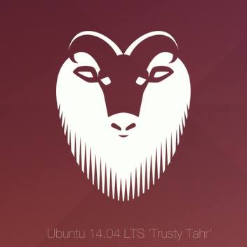
- ROS Indigo (Robot Operating System)  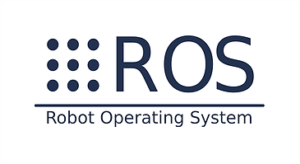
- OpenCV (Recognising certain objects)  
- CvBridge (Bridge between ROS and OpenCV) 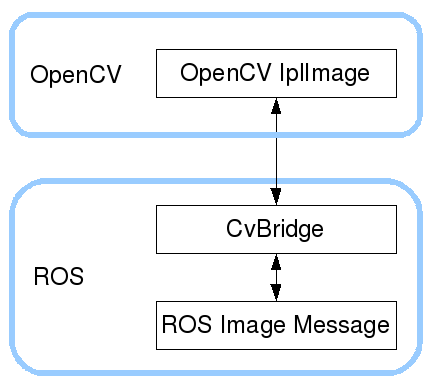
- Gazebo (Simulator) 
- C++ 
- Bash 
- More packages (Tum_sim, Ardrone_Autonomy,...) 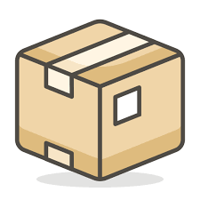

## Hardware used?
- ARDrone 2.0
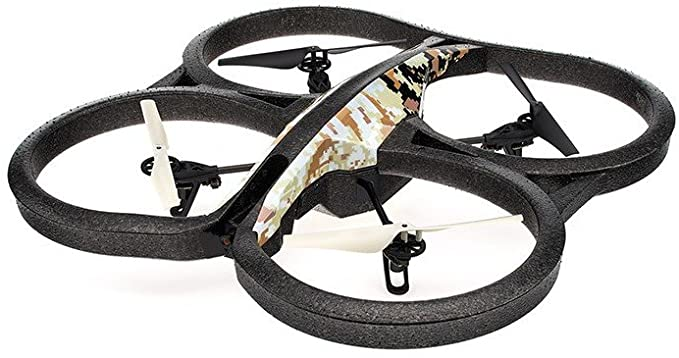

- Dell computer
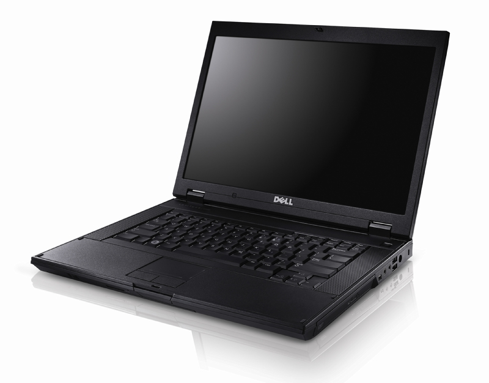

## Short overview
In the image below you can see that the computer is connected to the WiFi signal of the drone.
The computer sends out a command to the drone (takeoff command). After that the drone goes in the air.
In return the Ardrone sends out the camera feed to the computer.
The computers start analyzing the camera feed using OpenCV and it generates yhe most appropriate command for the drone and sends it to the drone. 
This command depends on where the red circle is positioned.

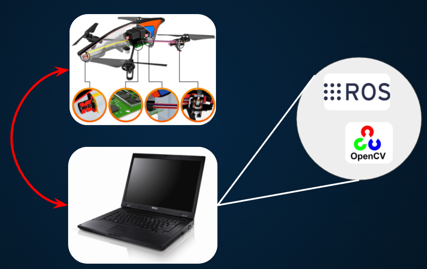

## How did we make the project?
In the picture down below you will see our file structure (starting in the workspace file tum.ws).

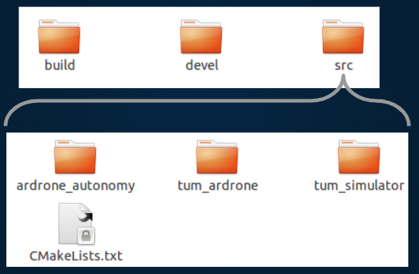

Here you have three directories. The first directory has the build files, these files are made automatically by running a command. 
More about this command later.
The second directory is the "devel" directory this one is generated and can contain files you use for development and running the ROS framework. 
The last directory you will find is the most important one, this is the "src" directory. Here you can find the source files of the project.
In this "src" directory you will find three more directories and one txt file:
- ardrone_autonomy -> Here you can find the camera commands, the land function, the takeoff function and drivers. These are more specific drivers. (for parrot ar drone 2.0)
- tum_ardrone -> Here you can find the automatisation of the drone. You can find the more generally drivers here.
- tum_simulator -> This directory cantains everthing for the Gazebo simulator. 
- CMakeLists.txt -> This file contains all the dependencies and the references to other packages important for the project.

### What does the CMakeLists.txt contain?
In the code down below we have filtered out the most important parts.
All the other parts are also genarated with the **catkin_make** command.

**NOTE:** if you are using Python and you are using an ROS package before Melodic you should run this command first. 
```bash
catkin_make -DPYTHON_EXECUTABLE=/usr/bin/python3
```
**CMakeLists.txt snippet 1:**
```txt
cmake_minimum_required(VERSION 2.8.3)
project(ardrone_autonomy)

# Load catkin and all dependencies required for this package
find_package(catkin REQUIRED COMPONENTS
    roscpp
    image_transport
    sensor_msgs
    std_srvs
    tf
    camera_info_manager
    message_generation
    roslint
    cv_bridge
    geographic_msgs
    geometry_msgs
    rospy
    std_msgs
)

find_package(OpenCV REQUIRED)

```
Here you declare all the packages your project needs. 
I will go over a few of them with you:
- roscpp -> If we have this package we can use C++ code in our project (important for later in this tutorial).
- image_transport -> Used to create and trasfered the images from the incomming camera feed.
- sensor_msgs -> Used for giving command to all the sensors of the ardrone
- cv_bridge -> Important package, because it makes the bridge/connection between OpenCV and ROS Indigo
- geographic_msgs and geometry_msgs -> These packages are used for ROS messages for Geographic Information Systems and ROS messages for Geometry Information
- OpenCV -> This package is used for analysing an image. And in our case finding a red cricle.

**CMakeLists.txt snippet 2:**
```txt
add_service_files(
    DIRECTORY srv
    FILES
    CamSelect.srv
    FlightAnim.srv
    LedAnim.srv
    RecordEnable.srv
)

# Generate added messages and services with any dependencies listed here
generate_messages(DEPENDENCIES geometry_msgs std_msgs)

catkin_package(
  DEPENDS libsdl-dev
  CATKIN_DEPENDS
    roscpp
    image_transport
    message_runtime
    sensor_msgs
    std_srvs
    tf
    camera_info_manager
)
```
In this part of the CMakeLists you add the service files you need (the are generated using the catkin_make command).
There are also some extra services that came with the ardrone_autonomy package. They could be used for purposes like recording camera feed, different flight modi, different light settings, etc.
Also you will need to add some dependencies before you can use the packages listed above with CATKIN_DEPENDS.

**CMakeLists.txt snippet 3:**
```txt
# Find sdk directories for headers and libraries in devel space
set(SDK ${CATKIN_DEVEL_PREFIX}/src/ardronelib/ARDroneLib/)
include_directories(
    ${SDK}
    ${SDK}/FFMPEG/Includes
    ${SDK}/Soft/Common
    ${SDK}/Soft/Lib
    ${SDK}/VP_SDK
    ${SDK}/VP_SDK/VP_Os/linux
)

include_directories(
    ${OpenCV_INCLUDE_DIRS}
)

link_directories(${CATKIN_DEVEL_PREFIX}/lib/ardrone)

# Add CATKIN_INCLUDE_DIRS
include_directories(${catkin_INCLUDE_DIRS})

include_directories(SYSTEM ${OpenCV_INCLUDE_DIRS})

# Add Boost_INCLUDE_DIRS
include_directories(${Boost_INCLUDE_DIRS})

# Add headers directory
include_directories(include)
```
Here you need to include every directory you are using for the project. Most of them are generated automatically by the catkin_create command. 

**CMakeLists.txt snippet 4:**
```txt
# Set SOURCE and HEADER files

set(AA_HEADERS
    include/ardrone_autonomy/ardrone_driver.h
    include/ardrone_autonomy/video.h
    include/ardrone_autonomy/ardrone_sdk.h
    include/ardrone_autonomy/teleop_twist.h
)

set(AA_SOURCES
    src/ardrone_driver.cpp
    src/video.cpp
    src/ardrone_sdk.cpp
    src/teleop_twist.cpp
)
```
We are setting up the source and header files. 
This is also generated, but it is important to note that you sometimes need to change some of these sources to meet your goals.

**CMakeLists.txt snippet 5:**
```txt
# Build executable
add_executable(ardrone_driver ${AA_SOURCES})
target_link_libraries(
    ardrone_driver
    pc_ardrone
    avcodec
    swscale
    avutil
    vlib
    sdk
    SDL
    ${Boost_LIBRARIES}
    ${catkin_LIBRARIES}
)

add_executable(main src/main.cpp)
target_link_libraries(main
	${OPENCV_LIBRARIES}
	${catkin_LIBRARIES}
)

add_dependencies(ardrone_driver ardronelib ${PROJECT_NAME}_gencpp)

SET(CMAKE_CXX_FLAGS "-std=c++11 -O3")
```
Most of the executables you are using need to be build and linked to the libraries you are using.
For example the OPENCV_LIBRARIES are linked to the main.cpp, because we use these libraries in our main.cpp.
The last line 
```txt 
SET(CMAKE_CXX_FLAGS "-std=c++11 -O3")
```
Is used to set FLAGS, if you don't add this you will see an error message every time you run the catkin_make command.
This command ensures that when the catkin_make is executed, the c++ compiler is also involved. 

### What does the main.cpp do?

This C++ file is the main of our project, here we use the packages and libraries to make the drone follow a red circle.
I will explain this code one by one.

**main.cpp snippet 1:**
```cpp
#include <ros/ros.h>
#include <image_transport/image_transport.h>
#include <cv_bridge/cv_bridge.h>
#include <sensor_msgs/image_encodings.h>
#include <opencv2/imgproc/imgproc.hpp>
#include <opencv2/highgui/highgui.hpp>
#include <opencv2/core/core.hpp>
#include <geometry_msgs/Twist.h>
#include <std_msgs/Empty.h>
#include <std_srvs/Empty.h>
#include <iostream>
#include <chrono>
#include <vector>

using namespace cv;
using namespace std;
```

It is very important in C++ that you use the right includes.
You should also declare the namespaces, this will make it easier for you to write the code without everytime using the extensions like:
```cpp
cv::command
```

**main.cpp snippet 2:**
```cpp
/* Drone Publisher */
ros::Publisher rostopictakeoff;
ros::Publisher rostopiclanding;
ros::Publisher cmd_vel;
ros::ServiceClient flattrim;
```
Here we declare the Publishers and a Service Client:
- rostopictakeoff -> this Publisher is used to let the drone takeoff.
- rostopiclanding -> this publisher is used to let the drone land.
- cmd_vel -> this publisher is used to let the drone move up/down/forward/backward/left/right.
- flattrim -> this ServiceClient is used to create more stability for the drone.

**main.cpp snippet 3:**
```cpp
geometry_msgs::Twist changeTwist(float x, float y, float z, float turn)
{
    geometry_msgs::Twist msg_vel;
    msg_vel.angular.x = 0;
    msg_vel.angular.y = 0;
    msg_vel.angular.z = turn; //turn right and left
    msg_vel.linear.x = x; //move horizontally --> forward and backward
    msg_vel.linear.y = y; //move horizontally --> left and right
    msg_vel.linear.z = z; //move vertically --> up and down 
    return (msg_vel);
}

// Stabilisation of the drone after take off or following the target
void ajuste(void)
{
    std_srvs::Empty srvflattrim;
    flattrim.call(srvflattrim);
}
```
The **changeTwist** command is used througout the whole main.cpp.
This command will make the drone move in every way possible. You can also add values so the drone moves faster or slower with a max value of **1**.
The **adjuste** function calls the ServiceClient *flatrim* to make the drone stabilise.

**main.cpp snippet 4:**
```cpp
// Take off function including stabilising
void takeoff(void)
{
    std_msgs::Empty empty;
    geometry_msgs::Twist msg_vel;
    rostopictakeoff.publish(empty);
    printf("Taking off\n");
    usleep(300000);
    printf("Stabilisation\n");
    msg_vel = changeTwist(0, 0, 0, 0);
    cmd_vel.publish(msg_vel);
}

// Land function
void land(void)
{
    std_msgs::Empty empty;
    rostopiclanding.publish(empty);
}
```
These two functions are:
- takeoff function -> Initialses std_msgs, geometry_msgs, msg_vel. It also lets the dron takeoff.
- land fucntion -> Clears the std_msgs and lets the drone land safely.

**main.cpp snippet 5:**
```cpp
void doEverything(string direction, float r)
{
 float acc;

    if (direction == "forward") {
    acc = 1-((r/50) * 1);
     if (acc > 1){acc = 1;}
    geometry_msgs::Twist msg_vel;
    msg_vel = changeTwist(acc, 0,0,0);
    cmd_vel.publish(msg_vel);
    printf("do everything forward %f \n", acc );
   }

    if (direction == "backward") {
    acc = (r/100) * (-1);
     if (acc < -1){acc = -1;}
    geometry_msgs::Twist msg_vel;
    msg_vel = changeTwist(acc, 0,0,0);
    cmd_vel.publish(msg_vel);
    printf("do everything backward %f \n", acc);
    }
   
    if (direction == "up") {
    acc = (r/100) * 1;
     if (acc > 1){acc = 1;}
    geometry_msgs::Twist msg_vel;
    msg_vel = changeTwist(0,0,acc,0);
    cmd_vel.publish(msg_vel);
    printf("do everything up %f \n", acc);
    }

    if (direction == "down") {
    acc = (r/100) * (-1);
     if (acc < -1){acc = -1;}
    geometry_msgs::Twist msg_vel;
    msg_vel = changeTwist(0,0,acc,0);
    cmd_vel.publish(msg_vel);
    printf("do everything down %f \n",acc);
    }

    if (direction == "turnLeft") {
	acc = (r/200) * 1;
     if(acc > 1){acc = 1;}
    geometry_msgs::Twist msg_vel;
    msg_vel = changeTwist(0,0,0,acc);
    cmd_vel.publish(msg_vel);
    printf("do everything left %f \n",acc);

    }

    if (direction == "turnRight") {
     if (acc < -1) {acc = -1;}
    geometry_msgs::Twist msg_vel;
    msg_vel = changeTwist(0,0,0,acc);
    cmd_vel.publish(msg_vel);
    printf("do everything right %f \n", acc);
    }

}
```
The funtion **doEverything** is the function to let the drone move faster or slower and in the right direction to the circle.
We use acc or the "p-value" to determine how fast de drone can move forward/backward/up/down/right/left.

*But what is the p-value?*

This is the value to determine how fast or how slow the drone needs to go depending on the target size. 
For example if the circle is very small, the drone needs to accelerate much faster towards the red circle.
If the cricle gets bigger (closer to the circle) then the drone needs to decrease its velocity towards the target.
See picture below.

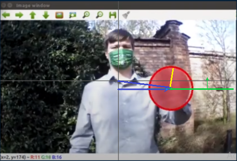

The yellow line represents the radius, the radius on this picture is good, so the drone doesn't need to go forward or backward.
The blue line represents how far away the circle is from the y-axis, this means that the drone needs to turn right. Here we calculate the p-value and then the drone turns right with the value of p. (in this example the value is low).
The green line and arrow represent how far away the circle is from the x-axis. This means the drone needs to go down. But how fast? Here we calculate the p-value and by doing this we can see that the drone needs to go down slowly.
The min and max value of P is capped to -1 and +1.

**main.cpp snippet 6:**
```cpp
// Stopping the drone --> it results in hoverring mode
void stop(void)
{
    geometry_msgs::Twist msg_vel;
    msg_vel = changeTwist(0, 0, 0, 0);
    cmd_vel.publish(msg_vel);
    printf("Stopping the drone.\n");
}
```
This function is to stabilise the drone when no circle is found for example

**main.cpp snippet 7:**
```cpp
static const std::string OPENCV_WINDOW = "Image window";

// Class used for converting the incomming drone camera image to the HSV recognized image
class ImageConverter
{
    ros::NodeHandle nh_;
    image_transport::ImageTransport it_;
    image_transport::Subscriber image_sub_;
    image_transport::Subscriber image_sub_depth;
    image_transport::Subscriber image_sub_threshold;
    image_transport::Publisher image_pub_;
    image_transport::Publisher image_pub_depth;
    image_transport::Publisher image_pub_threshold;

public:
    ImageConverter()
        : it_(nh_)
    {
        // Subscrive to input video feed and publish output video feed
        image_sub_ = it_.subscribe("/ardrone/image_raw", 1,
                                   &ImageConverter::imageCb, this);
        //printf("subscribed");
        image_pub_ = it_.advertise("/image_converter/output_video", 1);
        //printf("published");
        cv::namedWindow(OPENCV_WINDOW);
    }

    ~ImageConverter()
    {
        cv::destroyWindow(OPENCV_WINDOW);
    }

    void imageCb(const sensor_msgs::ImageConstPtr &msg)
    {
        cv_bridge::CvImagePtr cv_ptr;
        try
        {
            cv_ptr = cv_bridge::toCvCopy(msg, sensor_msgs::image_encodings::BGR8);
        }
        catch (cv_bridge::Exception &e)
        {
            ROS_ERROR("cv_bridge exception: %s", e.what());
            return;
        }
```
Here we use OpenCV to look at the incomming video. 
We declare some new subscribers and publishers from image_transport.
Image_sub_ subscribes to the the incomming video from the ar drone.
Image_pub_ publishes the video so we can use it to analyse.
Also we link ROS framework to OpenCV using cvBridge.

**main.cpp snippet 8:**
```cpp
// Convert input image to HSV
        cv::Mat HSVImage;
        cv::cvtColor(cv_ptr->image, HSVImage, COLOR_BGR2HSV);

        cv::Size size = HSVImage.size();
        cv::Mat mask = cvCreateMat(size.height, size.width, CV_8UC1); //CV_8UC1 = grayscle mask

        // Detecting colors --> starting with higher contrast to lower for the colors
        cv::Mat lower_red_hue_range;
        cv::Mat upper_red_hue_range;
        cv::inRange(HSVImage, cv::Scalar(0, 100, 100), cv::Scalar(10, 255, 255), lower_red_hue_range);
        cv::inRange(HSVImage, cv::Scalar(160, 100, 100), cv::Scalar(179, 255, 255), upper_red_hue_range);

        // Combine the images from the range lower and the upper range
        cv::Mat red_hue_image;
        cv::addWeighted(lower_red_hue_range, 1.0, upper_red_hue_range, 1.0, 0.0, red_hue_image);
        cv::GaussianBlur(red_hue_image, red_hue_image, cv::Size(9, 9), 2, 2);

        // Morphological closing (fill small holes in the foreground) --> removing the noise from the images and combining the elemenets
        dilate(mask, mask, getStructuringElement(0, Size(21, 21)));
        erode(mask, mask, getStructuringElement(0, Size(10, 10)));
        erode(mask, mask, getStructuringElement(0, Size(11, 11)));
        dilate(mask, mask, getStructuringElement(0, Size(5, 5)));

        // Use the Hough transform to detect circles in combined threshold images
        vector<Vec3f> circles;
        HoughCircles(red_hue_image, circles, CV_HOUGH_GRADIENT, 1, red_hue_image.rows / 8, 100, 20, 0, 0); // hough transform

        // Processing the circle and recognising it's center
        float x, y, r;
        for (size_t i = 0; i < circles.size(); i++) //i++ of ++i?
        {
            Point center(cvRound(circles[i][0]), cvRound(circles[i][1]));
            int radius = cvRound(circles[i][2]);
            // circle center
            circle(mask, center, 3, Scalar(0, 255, 8), -1, 8, 0);
            // circle outline
            circle(mask, center, radius, Scalar(0, 0, 255), 3, 8, 0);
            // circle center
            circle(cv_ptr->image, center, 3, Scalar(0, 255, 0), -1, 8, 0);
            // circle outline
            circle(cv_ptr->image, center, radius, Scalar(0, 0, 255), 3, 8, 0);
            x = circles[i][0];
            y = circles[i][1];
            r = circles[i][2];
        }
```
We first use OpenCV to detect the color red, we do this by using HSV color range as it lies closer to the human eye.
We set a range from two different red colors. So we can also see red in a more light and dark environnement.
Dilate and erode functions are used to cancel out the noise of the picture.
After this we put a grayscale mask over the image, here we can detect the red color (see image below).

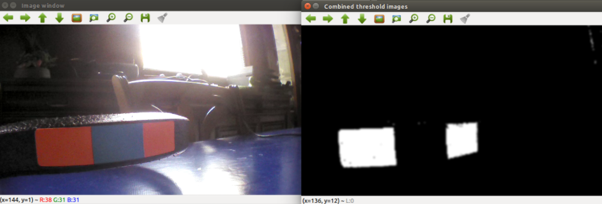

Then we create a vector "circles".
We use HoughCircles to detect every red circle it can find.
After that we try to find the center of the circles and the circumference of all the circles.
We use these later to determine how big the circle is and where the circle is.
(See image below)

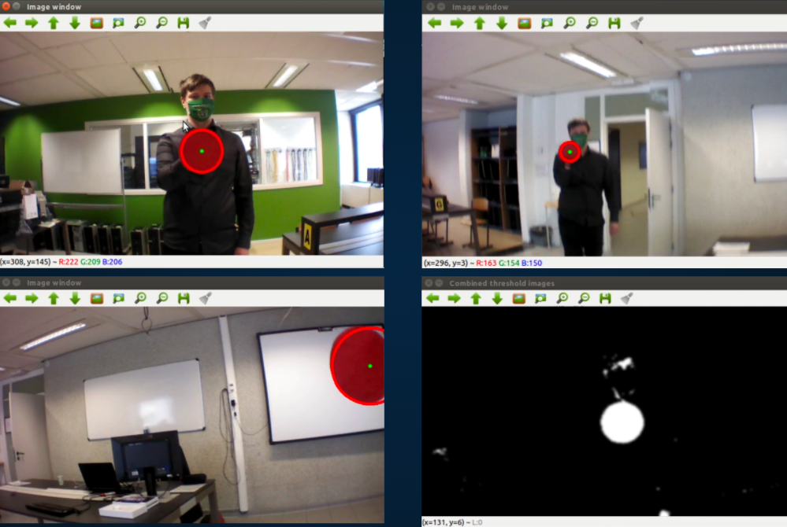

**main.cpp snippet 9:**
```cpp
if (r < 40 && r > 20) // Normal circle detected
        {
            if (temp1 == true)
            {
                stop();
                temp1 = false;
            }

            if (y < 200 && circles.size() > 0) // Lower half of the circle detected --> going up
            {
                doEverything("up", y);
                printf("up \n");
                temp2 = true;
            }


            if (y > 250 && circles.size() > 0) // Upper half of the circle detected --> going down
            {
                doEverything("down", y);
                printf("down\n");
                temp2 = true;
            }
```
Here we use y-axis to determin if the circle goes up or down and then the drone will move to iets postition.

**main.cpp snippet 10:**
```cpp
// The main function for executing all the functions above!
int main(int argc, char **argv)
{
    // -------- DRONE PART
    ros::init(argc, argv, "drone");
    ros::NodeHandle n;
    rostopictakeoff = n.advertise<std_msgs::Empty>("/ardrone/takeoff", 1, true);
    rostopiclanding = n.advertise<std_msgs::Empty>("/ardrone/land", 1, true);
    cmd_vel = n.advertise<geometry_msgs::Twist>("/cmd_vel", 1, true);
    flattrim = n.serviceClient<std_srvs::Empty>("/ardrone/flattrim");
    ajuste();
    printf("Calibration \n");
    takeoff();

    // ------ IMAGE PART
    ros::init(argc, argv, "image_converter");
    ImageConverter ic;
    while (1)
    {
        ros::spinOnce();
        if (waitKey(30) == 27)
        {
            cout << "esc pressed" << endl;
            break;
        }
    }
    return 0;
}
```
In the main function we do everything needed to initialise every function from above.
We also put in a while loop for when the you want to stop drone and stop running the main.cpp.

### How do you run our project?
First install the ROS indigo on the Ubuntu 14.04 using this [link](http://wiki.ros.org/indigo/Installation/Ubuntu). 
After that, you can pull our repository from GitLab. (git clone repo).
For making it all a lot easier, we have zipped the src folder. So, after clonning our repo, unzip the src folder into the tum_ws (the zipped src file will also be there).
Now you can open the terminal in the tum_ws and execute the catkin_make command.
Your new work directory will the tum_ws.

The main.cpp could be fount into the tum_ws/src/ardrone_autonomy/src folder. But We also have put a copy of the main.cpp in the repo itself.
 
Then connect your PC with the WiFi signal of the ardrone 2.0.
After that open a terminal and type:
```bash
source /opt/ros/indigo/setup.bash
source tum_ws/devel/setup.bash
roslaunch ardrone_autonomy ardrone.launch
```
It will now try to make connection with you ardrone 2.0

Open a new terminal:
```bash
source tum_ws/devel/setup.bash
rosrun ardrone_autonomy main
```
**NOTE:** To be sure you should also open a new terminal with the land function.

### Gazebo Simulator
We have used Gazebo Simulator to work from home during Covid-19 times.
[More info and download](http://gazebosim.org/)
In the picture below you will see how we used Gazebo Simulator during our project.

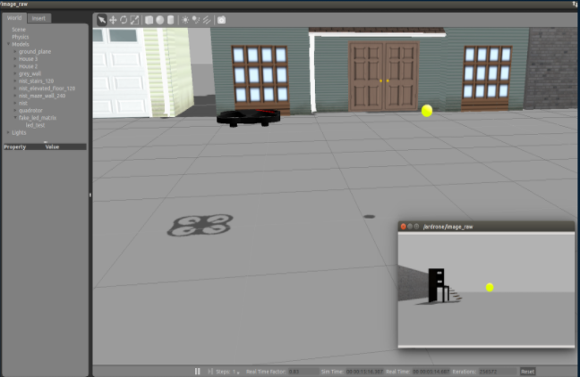

## Conclusion

The biggest problem we have encountered is that the connection between the drone is slow, this makes it so the drone gets a command later then supposed.
Solutions for this problem can be:
- Newer version of the drone (ROS noetic or higher imbedded).
- Installing a raspberry pi on the drone itself.

We have found this project very enjoyable to make and I hope you have enjoyed our post.

If you have any questions about our project please contact us.

* [Amir Sheikhzadeh](amir.sheikhzadeh@student.kdg.be),
* [Nathan Van Hof](nathan.vanhof@student.kdg.be),
* [Willem Claeys](willem.claeys@student.kdg.be)

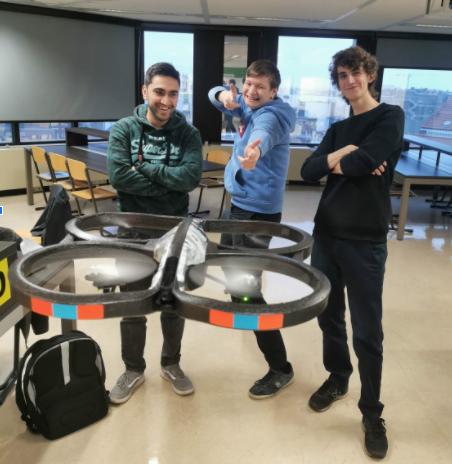


